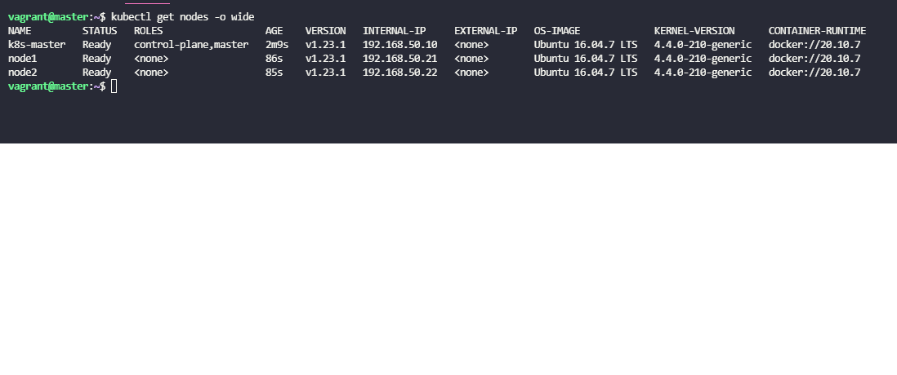

  <a href="#-tecnologias">Tecnologias</a>&nbsp;&nbsp;&nbsp;|&nbsp;&nbsp;&nbsp;
  <a href="#-como-executar">Como executar</a>&nbsp;&nbsp;&nbsp;

 

  

 

## ✨ Tecnologias

Esse projeto foi desenvolvido com as seguintes tecnologias:

- [Vagrant](https://www.vagrantup.com/)
- [Ansible](https://www.ansible.com/)
- [Docker](https://docs.docker.com/)
- [Kubernetes](https://kubernetes.io/pt-br/)
- [VitualBox](https://www.virtualbox.org/)

## 💻  Como executar

- Clone o repositório.
- Na raiz do projeto digite `vagrant up --provider=virtualbox` e aguarde até que todas vms são provisionadas.
- Para acessar alguma vm é só digitar o comando `vagrant ssh {nome_vm}`.
- Em sua maquina Local aponte o ip 192.168.56.240 para `dev.wordpress.com.br` em /etc/hosts no linux e mac
- Para rodar a aplicacão de teste Wordpress com Mysql acesse a vm master e digite o comando: `cd /home/vagrant/shared/wordpress && kubectl apply -k .`
- Aguarde subir os pods e acesse `http://dev.wordpress.com.br`

